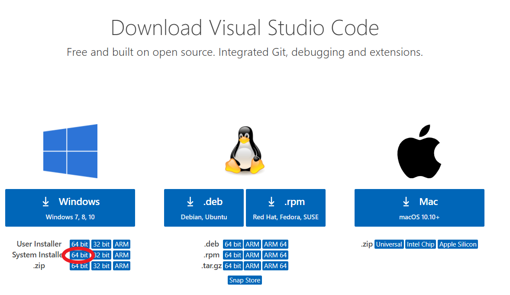
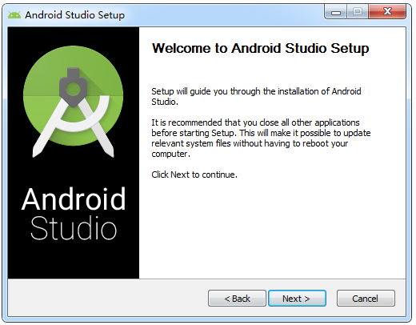

搭建xxx开发环境_模板
===============================

| 【参考】《Android移动医疗应用开发》P3

| 【注释】如果软件开发平台使用的语言是固定的（如 `AndroidStudio` ），则需要补充下一节 `第一个xxx工程` ，像 `VSCode` 则不用，等到某个具体的程序设计实验中再去补充如何使用 `VSCode` 新建文件或文件夹以及如何编译运行程序

| 【注释】此处说明下载链接/所提供的下载资源包，相关下载链接界面截图/下载资源包文件夹截图，提前说明软件版本，并嘱咐读者按照本以下步骤下载、安装和配置软件

| 【示例】
    
`Visual Studio Code官网下载链接 <https://code.visualstudio.com/download>`_

VSCode共有两个下载版本：

- | **User Installer** 版:安装在当前计算机帐户目录，仅限于当前账户，更换账户后无法使用

- | **System Installer** 版：安装在非用户目录,任何帐户都可以使用。(建议使用此版本)

| 根据不同系统选择不同类型。这里使用的是Windowsx64，推荐选择System Installer

安装
~~~~~~~~~~~~~~~~~~~~~~~~~~~~~~~~~~~~~

| 【注释】以下展示安装过程的软件界面截图，注意截图只需要截取软件界面，不要全屏截图；先文字说明，再配图；图片的注释需要说明 `安装步骤几`；此块内容不需要再出现标号/序号

| 【示例】

| 在安装Android Studio之前，先将本书配套资料包“02.相关软件\Android”文件夹中的.android.rar、.AndroidStudio3.1.rar和.gradle.rar文件复制到“C:\Users\Administrator”目录下，将Android.rar文件复制到“C:\Users\Administrator\AppData\Local目录下，然后分别解压这4个压缩包，注意，要确保解压后的文件夹中不能再嵌套同名的文件夹，以Android.rar为例，解压之后，Android文件夹中不能再包含一个Android文件夹。同时，要确保计算机处于联网状态。
| 双击运行本书配套资料包“02.相关软件\Android”文件夹中的android-studio-ide-173.4720617-windows.exe，在弹出的如图1 17所示的对话框中，单击Next按钮。

配置
~~~~~~~~~~~~~~~~~~~~~~~~~~~~~~~~~~~~~

| 【注释】以下说明软件安装完成后的环境的配置，如添加环境变量，配置中文开发环境，“设置”中相关参数的配置等