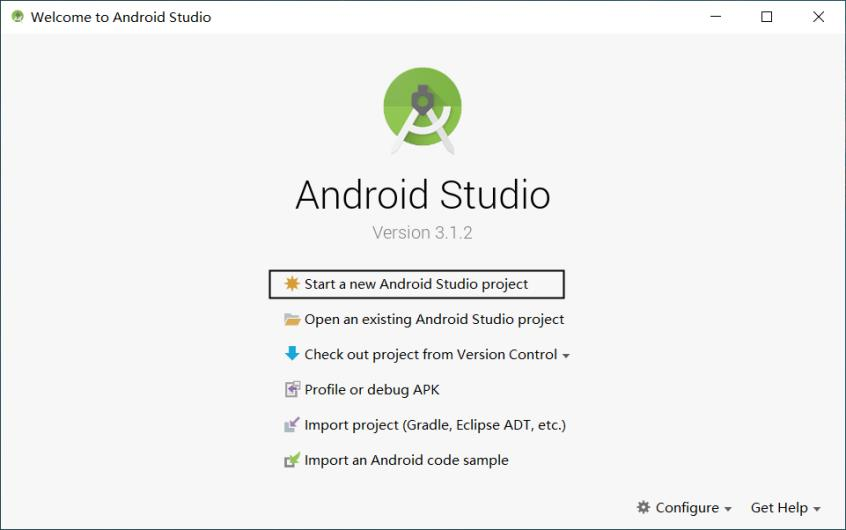
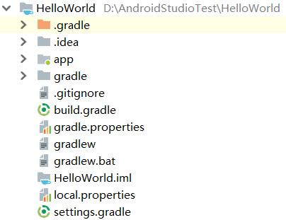

第一个HelloWorld工程
=======================

| 【参考】《Android移动医疗应用开发》P9-P17

创建并运行HelloWorld工程
~~~~~~~~~~~~~~~~~~~~~~~~~~~~~~~~~~~~~

| 【注释】以下展示创建工程过程的软件界面截图；先文字说明，再配图；图片的注释需要说明 `安装步骤几` ；此块内容不需要再出现标号/序号

| 【示例】
| 完成JDK的安装和配置，及Android Studio的安装后，可以通过新建一个HelloWorld工程，将其下载到Android手机中，验证Android开发环境是否搭建成功。
| 在计算机的D盘中建立一个AndroidStudioTest文件夹，在计算机的“开始”菜单中找到并单击Android Studio软件，在弹出的如图1 28所示的对话框中，单击Start a new Android Studio project。

调试工程
~~~~~~~~~~~~~~~~~~~~~~~~~~~~~~~~~~~~~
| 【注释】此处说明如何调试项目，典型的调试信息有哪些，可以截图示意

详解HelloWorld工程
~~~~~~~~~~~~~~~~~~~~~~~~~~~~~~~~~~~~~

| 【注释】此处衔接上文放一段说明，引出对工程目录结构的介绍

| 【示例】
| 成功运行HelloWorld工程后，回到Android Studio来了解HelloWorld工程的目录。任何一个新建的工程都会默认使用Android模式的目录结构，这种结构简洁明了，适合快速开发，但这并不是工程真实的目录结构。前面已经将Android目录切换到Project目录了，这才是工程真实的目录结构，如图1 40所示，接下来对该目录展开介绍。

| 【注释】以下是对工程目录结构的说明，先放工程木结构的截图，再文字说明；按照文件夹顺序展开，需要从 `1.` 开始标

| 【示例】

1. 文件夹1
2. 文件夹2
3. 文件1
4. 文件2

常见问题及解决方式
~~~~~~~~~~~~~~~~~~~~~~~~~~~~~~~~~~~~~

| 【注释】此处说明创建、编译、运行项目过程中可能出现的问题，报错信息需要有截图；问题的编号从 `1.` 开始标

| 【示例】

1. | 问题1的描述

| 问题截图
| 解决方式

2. | 问题2的描述

